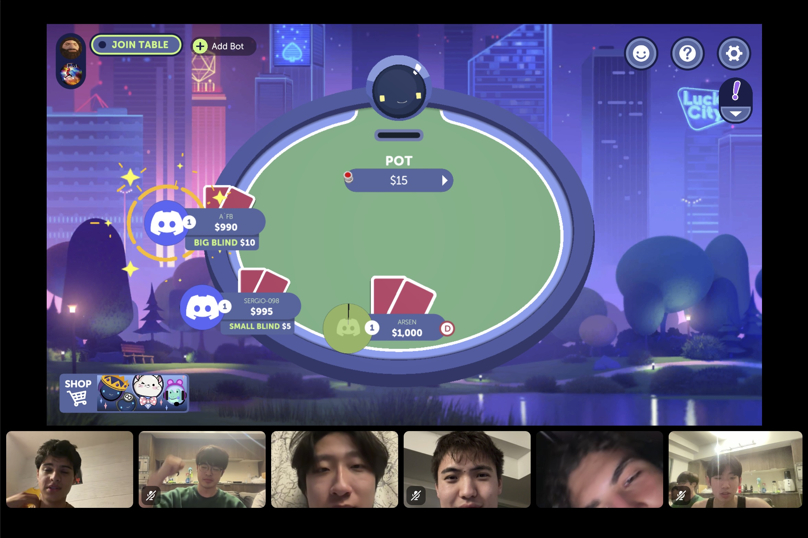

# YOUR PRODUCT/TEAM NAME
> _Note:_ This document will evolve throughout your project. You commit regularly to this file while working on the project (especially edits/additions/deletions to the _Highlights_ section). 
 > **This document will serve as a master plan between your team, your partner and your TA.**

## Product Details
 
#### Q1: What is the product?

Pulse is a web-based platform that helps businesses and organizations anticipate and plan for demand fluctuations by analyzing the impact of local events, news, weather, and other factors on hospitality and urban activity. Many hotels, event organizers, and city planners struggle to predict demand spikes around large concerts, conferences, sports games, or sudden local developments; Pulse addresses this by providing actionable insights and forecasts for these scenarios. The system is developed in collaboration with Peebles Group, which provides domain expertise, historical data, and guidance on agentic AI tools. Users can explore trends and demand projections through an interactive web interface or access structured data via APIs for integration into their own applications.

#### Q2: Who are your target users?

Due to the nature of our product, there could be various uses cases and there by could be various target users.

What we would classify as a “Primary User” would be Hospitality Revenue Managers in major cities within North America. These professionals are already responsible for capacity and demand planning. Current issues with their workflow could include limiting data sources and/ or manual research. By providing them a more comprehensive data platform, they can more efficiently and accurately preform there respective tasks.

Our secondary users could include both Planning Analysts in Urban cities Across NA as well as. Business Intelligence Developers contracted by firms in the hospitality industry. These professionals tasks usually include analyse and draw conclusions from economic patterns for infrastructure decisions or integrating demand data into existing business intelligence workflows and pipelines. With there technical backgrounds, a platform for structured and reliable data would greatly benefit them, which is what pulse aims to achieve.

#### Q3: Why would your users choose your product? What are they using today to solve their problem/need?

Pulse is designed to make existing workflows more efficient, accurate, and above all, accessible. Current event managers often depend on manual research drawn from fragmented sources. This process is not only highly inefficient but also introduces inaccuracies and undermines the reliability of conclusions, since the data is unstructured and cannot be properly computed. By offering a platform that automatically aggregates event data and delivers pre-computed key metrics, Pulse saves revenue managers and planners 10+ hours of manual work per week. Unlike existing solutions such as PredictHQ, which primarily targets enterprise clients, Pulse is open-source and built to serve a wide range of urban cities across North America. This aligns with Peebles Group’s mission to provide the hospitality industry with next level digital automation technology by automating the the collection, analysis, and distribution of event-driven insights, empowering businesses of all sizes to make data-informed decisions with speed and confidence.

#### Q4: What are the user stories that make up the Minumum Viable Product (MVP)?

# Pulse – Hospitality Event Insights

## US1: Event Data Discovery
**As a** hospitality revenue manager,  
**I want to** view upcoming events in my city with key metrics that reflect demand impact,  
**so that** I can make informed pricing decisions for the next 90 days.

**Acceptance Criteria:**
1. The system displays events within specified geographic boundaries.
2. Each event shows a potential impact category (Low / Medium / High).
3. Events include date, venue, estimated attendance, revenue, and event type.
4. Data refreshes automatically from web sources daily.

---

## US2: Event Data Heatmap
**As a** hospitality revenue manager,  
**I want to** view where these events are located with an interactive map,  
**so that** I can better visualize how demand will change in the regions surrounding the event.

**Acceptance Criteria:**
1. A map is displayed when the user navigates to the event data heatmap view.
2. The map loads without errors and shows a recognizable base layer (e.g., streets, regions).
3. Color gradients or heat levels reflect event density or size.
4. Users can zoom in/out and pan across the map.
5. Each event is represented by a visible marker (e.g., pin, circle, or heat intensity).

---

## US3: Favourite Locations
**As a** business owner (user),  
**I want to** set up to 3 locations as my favourites,  
**so that** I can have quick access to their key metrics and event information from the dashboard.

**Acceptance Criteria:**
1. A dashboard containing key events, a trend graph, and summary metrics is available to users when logging in.
2. Users can instantly access information about their favourited cities.

---

## US4: Developer API Usage
**As a** developer,  
**I want to** query structured event data and insights from the Pulse API,  
**so that** I can integrate this information into my application system.

**Acceptance Criteria:**
1. The developer can authenticate with the API using a secure method (e.g., API key or OAuth).
2. The developer can request event data filtered by attributes such as date range, location, event type, or other schema-specific fields.
3. The API returns structured, consistent JSON data conforming to the documented schema.
4. The developer can retrieve demand forecasting metrics or insights associated with events.
5. The API provides error handling and informative messages for invalid requests.
6. The developer can access API documentation, example queries, and code snippets to facilitate integration.

---

## US5: Predictive Demand Alerts
**As a** hospitality revenue manager,  
**I want to** receive automated alerts predicting significant changes in demand for my favourited locations,  
**so that** I can proactively adjust pricing, staffing, and inventory.

**Acceptance Criteria:**
1. The system analyzes upcoming events, historical trends, and ML-derived demand signals to identify potential spikes or drops in demand.
2. Users can configure alert thresholds based on expected attendance, revenue, or demand impact level.
3. Alerts are delivered through the web dashboard and optionally via email or push notifications.
4. Each alert includes the predicted change, the associated events, and recommended actions.
5. The system provides a history of past alerts and their accuracy for reference.

---

## US6: Event Comparison
**As a** hospitality revenue manager,  
**I want to** compare multiple upcoming events side by side,  
**so that** I can see overlaps and trends that may affect demand.

**Acceptance Criteria:**
1. Users can pick two or more events to compare.
2. Comparison shows key details (date, venue, type, impact).
3. A trend graph shows how demand may change before, during, and after events.
4. The system warns the user when events occur at the same time or in the same area, using a clear visual indicator (e.g., color, icon, or label).

#### Q5: Have you decided on how you will build it? Share what you know now or tell us the options you are considering.

The backend will consist of JavaScript and Node.js, Express.js, and PostgreSQL. The machine learning will be done with Python. The frontend will be done with React, Redux, and shadcn/ui. The authentication will be done with KeyCloak. The application will be deployed through GCP or through Peebles Group’s servers. The application will be deployed either through GCP or through Peebles Group’s servers.

A few key APIs such as Google Places, OpenAI, and Gemini APIs will be used, and will be provided by Peebles Group.

----
## Intellectual Property Confidentiality Agreement 
We agreed to make the code public and shareable as an open source product with an MIT Licence.

----

## Teamwork Details

#### Q6: Have you met with your team?

1. Seungil Baik is Korean but he is born and raised in Japan. 
2. Mondher fought in an amateur kickboxing fight this past Summer.
3. Sergio Sanchez speaks 5 languages

We played poker together online on discord.

#### Q7: What are the roles & responsibilities on the team?

# Team Roles and Responsibilities

| Person  | Technical Role  | Non-Technical Role |
|---------|-----------------|------------------|
| Arsen   | Project Manager | Partner Liaison |
| Sean    | Front End       | Scrum Master / Meeting Head |
| Ben     | Back End        | Document Organizer |
| Mondher | Back End        | Research |
| Lucas   | Back End        | Schedule Manager |
| Sergio  | Front End       | Presentations / Demos |

## Role Descriptions

**Arsen**  
- **Technical Role:** Project Manager – Oversees the overall project progress, ensures timely delivery of components, and contributes to both front-end and back-end development as needed.  
- **Non-Technical Role:** Partner Liaison – Main point of contact with the project partner, responsible for communication, updates, and organizing partner feedback.  
- **Reason for Role:** Strong organizational and communication skills, capable of coordinating the team and partner effectively, and has experience working across the full stack.

**Sean**  
- **Technical Role:** Front End – Works on the user interface, event data visualizations, and interactive components like maps and dashboards.  
- **Non-Technical Role:** Scrum Master / Meeting Head – Leads meetings, facilitates sprint planning, and ensures agile processes are followed.  
- **Reason for Role:** Interested in front-end development and experienced in UI work; also demonstrates leadership in coordinating team meetings.

**Ben**  
- **Technical Role:** Back End – Develops APIs, server logic, and integrates data sources for the event system.  
- **Non-Technical Role:** Document Organizer – Maintains and organizes technical documentation, meeting notes, and version control logs.  
- **Reason for Role:** Experienced in back-end development; meticulous in documentation.

**Mondher**  
- **Technical Role:** Back End – Works on database management, data pipelines, and API integrations.  
- **Non-Technical Role:** Research – Investigates event data sources, demand prediction methods, and ML algorithms.  
- **Reason for Role:** Strong analytical skills and interest in research-oriented work.

**Lucas**  
- **Technical Role:** Back End – Supports server-side development and database operations.  
- **Non-Technical Role:** Schedule Manager – Maintains project timelines, sprint schedules, and ensures deadlines are met.  
- **Reason for Role:** Organized and focused on time management.

**Sergio**  
- **Technical Role:** Front End – Implements dashboards, graphs, and event heatmaps.  
- **Non-Technical Role:** Presentations / Demos – Prepares and delivers project demos and presentations to stakeholders.  
- **Reason for Role:** Skilled in front-end development and comfortable presenting work to an audience.

#### Q8: How will you work as a team?

In our first meeting, we went through a list of questions we each curated to ask our partner to get a better understanding of the project. Our partner answered to the best of his abilities, and Ben took notes on all the answers.

We will have recurring online meetings every Thursday at 7pm. The purpose of each meeting is to discuss issues, completed progress, and set goals to be completed by the next meeting.
  
#### Q9: How will you organize your team?

We will use Notion to keep track of documents, and take notes doing meetings. We will use Jira for goal tracking and task assignment. We will use Discord and Instagram for normal communication. Lastly, we will use Github for version control and code sharing.

#### Q10: What are the rules regarding how your team works?

The expected frequency of communication is attendance of weekly meeting, as well as answers within a few hours for queries. As mentioned above, Discord will be used for meetings and Instagram will be used for normal chat communication. Our process for communicating with our partner is meeting once or twice a week with our partner. We also have a WhatsApp group chat with our partner for any queries. Regarding attendance of meetings, more than 2 missed meetings without valid reasoning will lead to us notifying our TA. Our process for tracking tasks is with Jira. If action items are not being completed within a reasonable time, the TA will be notified and other group members will take over the task.

## Organisation Details

#### Q11. How does your team fit within the overall team organisation of the partner?
Our partner is Peebles group, a company which delivers digital automation solutions for the hospitality industry using AI, analytics and smart tech. Since Pulse is new project, mainly for the company to explore the applications of agentic AI and ML pipelines on structured event data for demand forecasting, our team’s role will mainly be product development, where we build an MVP and the API for developer usage. Furthermore, I think documentation and communicating our process to the technical mentor will also be a crucial aspect of our project, in order gain a holistic understand of how they can implement our MVP, API, and overall findings into their business. Our team is fit for this role, because we all have experience building full stack applications, but several of our team members also have worked in startups and within the industry, so we understand how to work within ambiguous problem spaces to delivering production impact products, and properly documenting along the way. Overall, our goal is not only to deliver a working MVP and API, but also to provide Peebles Group with a clear foundation that they can build on.

#### Q12. How does your project fit within the overall product from the partner?
Our project will be the first step and the foundation to assist Peeble’s group in transforming an AI-powered event data pipeline into a working product. Currently, the product exists in the system design stage, with only a few reusable libraries available, like an LLM agentic orchestration toolkit and a web-browsing agent toolkit. No implementation has been done so far, so this positions our team to deliver the MVP that will form the foundation of the broader product.

Our scope and ownership

- MVP + Core API: We will design and implement the MVP system and its REST API endpoints, allowing developers and partner systems to query structured event data and derived insights.
- Pipeline Development: We will integrate the agentic search, schema classification, and ML forecasting pipeline into a functional prototype.
- Product Documentation: We will ensure the system is documented for both technical mentors and future developers, making it extensible.
- Communication Layer: Our MVP will serve both developer-facing needs (via the API) and business/administrator-facing needs (via a lightweight web application interface).

What success looks like for our partner

Peebles Group considers this project a success if our team can deliver:

1. A functioning MVP of the system that demonstrates the end-to-end flow: event sourcing, schema classification, correlation with demand, and querying via API.
2. A developer-ready API that external applications can consume for downstream tasks.
3. Documentation and design **artifacts** that provide clarity on how the system works and how it can be extended.
4. A proof of concept that demonstrates the business potential of event-driven demand forecasting in hospitality, laying the groundwork for immediate ML applications and long-term productization.

## Potential Risks

#### Q13. What are some potential risks to your project?

- Rate limiting on web-scraping
    - Rate limiting on web scraping is a major risk because Pulse's core functionality depends on LLM agents continuously collecting fresh event data from multiple websites, and rate limits can block or severely slow this data collection pipeline.

- Difficulty training ML model
    - We may not have enough demand data to train an ML model to forecast demand. Peebles Group has some data that can be used to train an ML model. However, this data is limited mainly to demand in the Toronto Area, as well as some areas in the US.

- Sub-teams working on different timelines to deliver on use cases.
    - Given the API developer tool and web-app responsibilities teams may not be working in sync so that some things are ready in time to be implemented with other parts.

#### Q14. What are some potential mitigation strategies for the risks you identified?

- Difficulty training ML model
    - We may be able to extrapolate the data that Peebles Group provided, but this data could be inapplicable to other regions.

- Sub-teams working on different timelines to deliver on use cases.
    - We will be in constant communication in meetings and through communication channels to ensure that everything is on the correct timeline. If one team falls behind we can reallocate resources to help catch up. This only works if we are communicating consistently.
